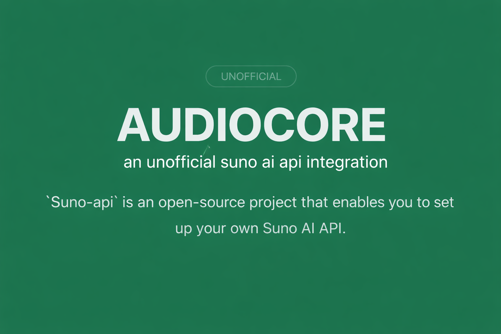

> **Audio Core v1.2.0** - High-fidelity music generation system.
> - ✅ AI-Powered Lyrics (ChatGPT integration)
> - ✅ Multi-Account Rotation (Cookie cycling)
> - ✅ Production-Ready Security (API Key Auth)
> - ✅ Modern Studio UI (Artwork & Downloads)
> - ✅ Fedora/Linux Compatible

<div align="center">
  <h1 align="center">
      AUDIO CORE
  </h1>
  <p>Advanced AI Music Generation Engine & API</p>
</div>



## Introduction

Audio Core is a professional-grade interface and API for Suno AI. It features a complete creative flow from concept to studio master, including automatic lyrics generation via ChatGPT and a robust multi-account management system.

## Features

- **AI Composition Studio:** Integrated ChatGPT flow to generate lyrics and styles that feed directly into the music engine.
- **Multi-Account Rotation:** Support for multiple Suno accounts via cookie rotation (use `|||` separator).
- **Studio Masters:** Generation results include track artwork, integrated players, and direct MP3 download support.
- **Production Security:** Built-in API Key authentication system (`Bearer Token`).
- **Standard API:** Fully compatible with OpenAI’s `/v1/chat/completions` format.
- **Anti-Bot Protection:** Integrated with [rebrowser-patches](https://github.com/rebrowser/rebrowser-patches) and Playwright.

## Getting Started

### 1. Obtain your Suno Cookies
1. Head over to [suno.com/create](https://suno.com/create).
2. Open the browser console (`F12`) -> `Network` tab.
3. Refresh and find a request to `client?_clerk_api_version`.
4. Copy the `Cookie` value from the headers.

### 2. Configure Environment
Create a `.env` file based on `.env.example`:
- `SUNO_COOKIE`: Your cookie(s). Separate multiple accounts with `|||`.
- `TWOCAPTCHA_KEY`: Required for automated generation.
- `OPENAI_API_KEY`: Required for the AI Composition Studio.
- `APP_ENV`: Set to `production` to enable security.
- `API_KEY`: Your secret master key.

### 3. Run Locally
```bash
git clone https://github.com/Stevenkingx/audiocore.git
cd audiocore
pnpm install
pnpm exec playwright-core install chromium
pnpm run dev
```

## API Reference

- `/api/ai_lyrics`: Generate structured lyrics using ChatGPT.
- `/api/generate`: Basic music generation.
- `/api/custom_generate`: Full control over lyrics, tags, and title.
- `/api/get`: Retrieve generated variations and audio URLs.
- `/api/get_limit`: Check account credits and usage.

## Integration with Custom Agents

Audio Core is fully compatible with AI Agent platforms like **GPTs**, **Coze**, and **LangChain**. Use the provided `/swagger-audiocore.json` to import all capabilities as tools.

## Support this Project

If this project has helped you, consider supporting the development:
- **Buy Me a Coffee:** [buymeacoffee.com/marxan](https://buymeacoffee.com/marxan)

## Credits

- Originally created by [gcui-art/suno-api](https://github.com/gcui-art/suno-api).
- Significantly updated by [zach-fau](https://github.com/zach-fau/suno-api).
- Modern UI, AI Studio, and Security maintained by [Stevenkingx](https://github.com/Stevenkingx/audiocore).

## License
LGPL-3.0 or later.